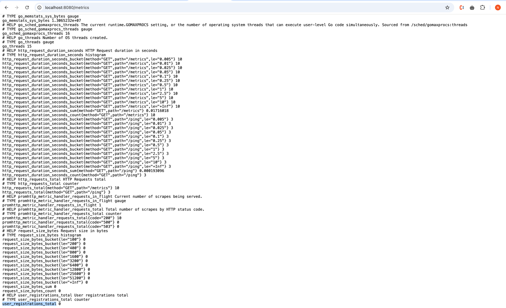
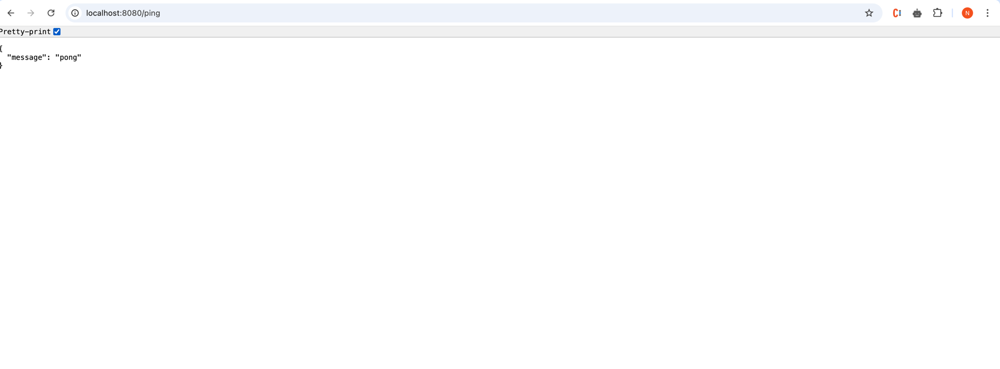
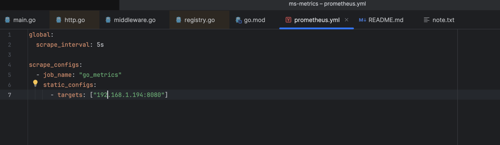
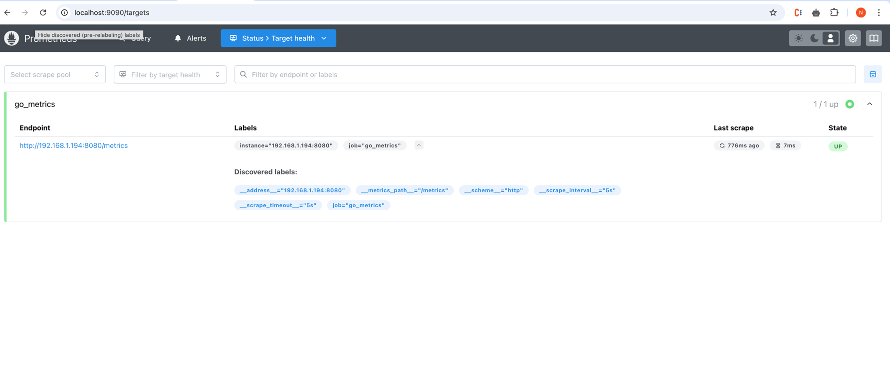
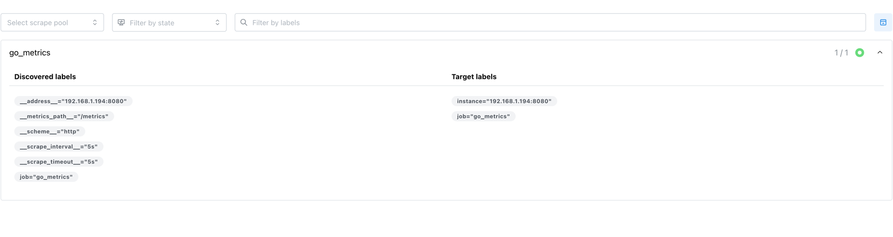
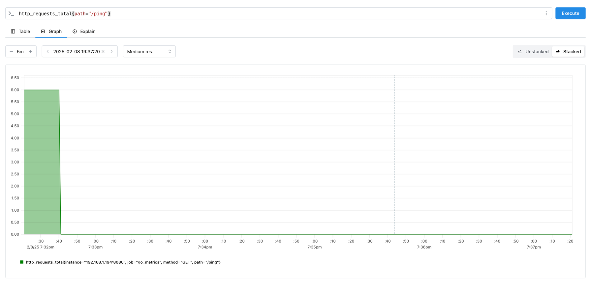

# Golang Microservice integration with Prometheus Metrics

### Golang microservice expose metrics via /metrics API

### Create some APIs(/ping) to let Prometheus collect

### Configure Prometheus to link to Golang microservice

#### Then run Prometheus with this config

`
docker run -d --name prometheus -p 9090:9090 -v $(pwd)/prometheus.yml:/etc/prometheus/prometheus.yml prom/prometheus
`

#### Prometheus run in :9090

#### It can see the Golang service 

#### We can show the statistic using Graph in Prometheus
